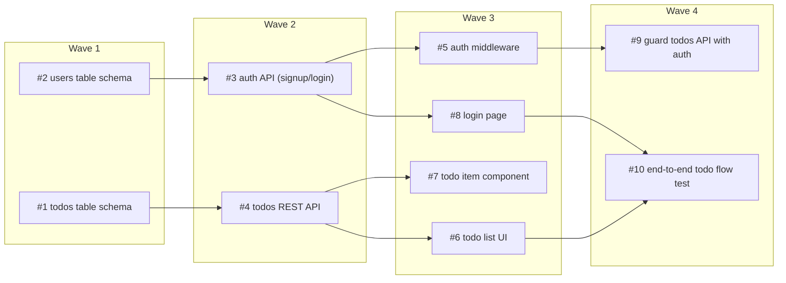

# 🏃 Skills for long running sprints

> Describe a goal. Get a wave-ordered DAG of interconnected GitHub issues. Let one agent work them to completion — at your pace or unattended.

Four agent skills that turn a one-line goal into a **dependency-ordered sprint of
GitHub issues**, then run them **one at a time, safely**, on your machine. No
cluster, no Linear, no private infra — just `gh`, `claude`, and your repo.

```bash
npx skills add anupam-io/sprint-skills
```

Works in Claude Code, Cursor, Copilot, and 15+ other agents via the
[Vercel skills](https://skills.sh) ecosystem.

---

## What it looks like

You say *"add a todo app with auth"*. `sprint-plan` decomposes it into right-sized
issues, figures out what blocks what, and lays them out as **readiness waves** —
wave 1 is everything startable now; each later wave unlocks as its dependencies
merge:



You approve the graph, the issues get created on GitHub, and the runner works them
in order. Three worked plans — open the `dag.html` in each, or read the `promise.md`:

- [`examples/todo-app-sprint/`](examples/todo-app-sprint/) — a todo app with auth (10 issues, 4 waves)
- [`examples/k8-monitoring-sprint/`](examples/k8-monitoring-sprint/) — a live pod-monitoring dashboard (13 issues, 5 waves)
- [`examples/eth-explorer-sprint/`](examples/eth-explorer-sprint/) — an Etherscan-style explorer (16 issues, 6 waves)

## 90-second quickstart

```bash
npx skills add anupam-io/sprint-skills          # 1. install
bash .claude/skills/sprint/run-sprint.sh doctor   # 2. preflight (gh authed? claude? node? jq?)

# 3. in your agent: "plan a sprint to <your goal>"   → review the DAG → approve
#    issues are created on GitHub with a Plan + a verifiable Definition of Done

bash .claude/skills/sprint/run-sprint.sh --hitl   # 4. work it — you review + merge each PR
#   ...or, when you trust it:
bash .claude/skills/sprint/run-sprint.sh --afk -n 10   # autonomous: PR + safe-merge, up to 10 issues
```

## You're always in control

**Nothing touches git until you pick a mode.** Every run is an explicit choice:

| Mode | What the agent does | Your base branch |
|------|---------------------|------------------|
| **HITL** *(Human In The Loop)* | implements each issue, opens a PR, then **stops** | untouched — *you* review + merge |
| **AFK** *(Away From Keyboard)*  | implements, opens a PR, **safely merges**, moves on — unattended | merged only because you chose AFK |

- **One agent at a time.** Issues run strictly sequentially — which is exactly what
  lets the agent rebase, resolve, and merge without races, so nothing gets lost.
- **It only touches your GitHub** issues, PRs, and branches — and the sprint's own
  files under `.claude/sprints/`. Nothing else.
- **Re-running is always safe.** State is reconciled live from GitHub every time, so
  a crash, a `Ctrl-C`, or a fresh terminal never double-fires or loses a PR.
- **Bounded by default.** `-n` caps issues per run; `--budget` caps $ per issue.

## The skills

| Skill | What it does |
|-------|--------------|
| 🧩 **sprint-plan** | Decomposes a goal (your prompt, a PRD, or the repo itself) into ~10-30 interconnected GitHub issues, assigns file ownership so they don't collide, and sorts them into a wave DAG you approve before anything is created. |
| 🏃 **sprint** | Runs an approved sprint: reconciles state from GitHub, picks the next unblocked issue, hands it to one agent end-to-end, repeats. Ships **`run-sprint.sh`** — the `-n`-bounded runner with a `doctor` preflight, live streamed output, and optional macOS voice narration. |
| ⚖️ **sprint-eval** | A 3-expert panel scores your plan 1-10 and tells you what's going to break before it does. |
| 🗺️ **sprint-pretty-html** | Standalone visualizer for a plan that *didn't* come from `sprint-plan` — a Linear export, a Slack dump, whatever. Renders it as a self-contained interactive DAG grouped **by owner** (vs. the **by-type** `dag.html` `sprint-plan` emits for its own plans), so you can read how someone else's tickets chain together. |

### Grab just one

```bash
npx skills add anupam-io/sprint-skills --skill sprint-plan
```

Add `-a claude-code` (or `cursor`, `copilot`, …) to target a specific agent.

## Requirements

`gh` (authenticated) · `claude` CLI · `node` · `jq`. Run `run-sprint.sh doctor` —
it tells you exactly what's missing and the one command to install it. Voice
narration is macOS-only (`say`) and silenced with `--mute`; everything else runs
anywhere, including Linux/CI.

---

MIT © Anupam Kumar
