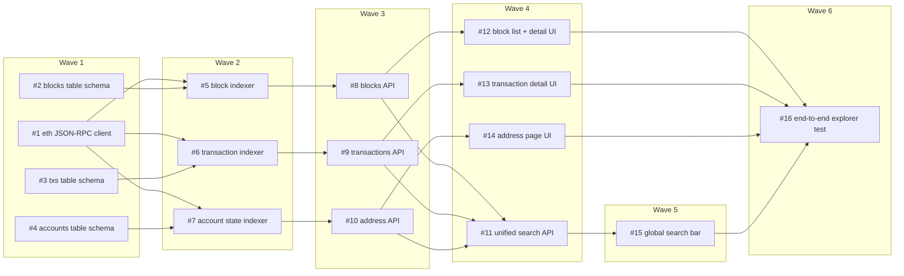

# Sprint 1 — an Ethereum blockchain explorer

Planned: 2026-06-14T19:10:00Z
Waves: 6   Issues: 16   Budget: $55

An Etherscan-style explorer: index blocks/transactions/accounts off a JSON-RPC node,
serve them through a REST API, and browse blocks, transactions, addresses, and a
global search from a web UI.

## Composition
| type | count |
|---|---|
| feature | 14 |
| improvement | 1 |
| qa | 1 |

## Issues
| # | type | title | files-owned | deps | wave |
|---|------|-------|-------------|------|------|
| 1  | feature     | eth JSON-RPC client       | backend/rpc/client.ts        | -            | 1 |
| 2  | feature     | blocks table schema       | db/schema/blocks.ts          | -            | 1 |
| 3  | feature     | txs table schema          | db/schema/txs.ts             | -            | 1 |
| 4  | feature     | accounts table schema     | db/schema/accounts.ts        | -            | 1 |
| 5  | feature     | block indexer             | backend/indexer/blocks.ts    | 1, 2         | 2 |
| 6  | feature     | transaction indexer       | backend/indexer/txs.ts       | 1, 3         | 2 |
| 7  | feature     | account state indexer     | backend/indexer/accounts.ts  | 1, 4         | 2 |
| 8  | feature     | blocks API                | backend/api/blocks.ts        | 5            | 3 |
| 9  | feature     | transactions API          | backend/api/txs.ts           | 6            | 3 |
| 10 | feature     | address API               | backend/api/accounts.ts      | 7            | 3 |
| 11 | feature     | unified search API        | backend/api/search.ts        | 8, 9, 10     | 4 |
| 12 | feature     | block list + detail UI    | ui/Blocks.tsx                | 8            | 4 |
| 13 | feature     | transaction detail UI     | ui/TxDetail.tsx              | 9            | 4 |
| 14 | feature     | address page UI           | ui/Address.tsx               | 10           | 4 |
| 15 | improvement | global search bar         | ui/SearchBar.tsx             | 11           | 5 |
| 16 | qa          | end-to-end explorer test  | tests/e2e/explorer.spec.ts   | 12,13,14,15  | 6 |

## Wave DAG

## Out of scope
- Internal transactions / trace-level decoding
- Token (ERC-20/721) indexing and balances
- Mempool / pending-transaction view
- Multi-chain (Ethereum mainnet only this sprint)

## Definition of done (sprint)
- All sprint-1 issues merged
- `npm test` green, including the wave-6 end-to-end explorer flow
- Explorer runs locally against an RPC endpoint: latest blocks stream in, a tx hash
  resolves to its detail page, an address shows its transactions, search finds all three
