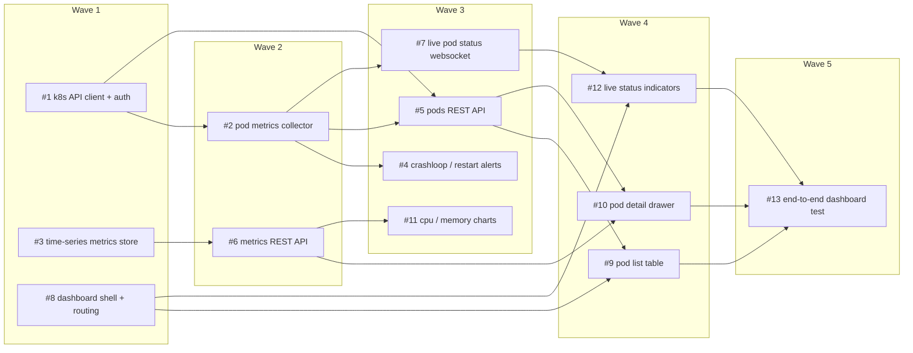

# Sprint 1 — a Kubernetes pod-monitoring dashboard

Planned: 2026-06-14T19:00:00Z
Waves: 5   Issues: 13   Budget: $45

A web UI that watches every running pod across your cluster: live status, CPU/memory
charts, a detail drawer per pod, and crashloop/restart alerts.

## Composition
| type | count |
|---|---|
| feature | 11 |
| improvement | 1 |
| qa | 1 |

## Issues
| # | type | title | files-owned | deps | wave |
|---|------|-------|-------------|------|------|
| 1  | feature     | k8s API client + auth       | backend/k8s/client.ts        | -          | 1 |
| 3  | feature     | time-series metrics store   | backend/store/timeseries.ts  | -          | 1 |
| 8  | feature     | dashboard shell + routing   | ui/Dashboard.tsx             | -          | 1 |
| 2  | feature     | pod metrics collector       | backend/collector/pods.ts    | 1          | 2 |
| 6  | feature     | metrics REST API            | backend/api/metrics.ts       | 3          | 2 |
| 4  | feature     | crashloop / restart alerts  | backend/alerts/rules.ts      | 2          | 3 |
| 5  | feature     | pods REST API               | backend/api/pods.ts          | 1, 2       | 3 |
| 7  | feature     | live pod status websocket   | backend/api/stream.ts        | 2          | 3 |
| 11 | feature     | cpu / memory charts         | ui/Charts.tsx                | 6          | 3 |
| 9  | feature     | pod list table              | ui/PodTable.tsx              | 5, 8       | 4 |
| 10 | feature     | pod detail drawer           | ui/PodDetail.tsx             | 5, 6       | 4 |
| 12 | improvement | live status indicators      | ui/LiveStatus.tsx            | 7, 8       | 4 |
| 13 | qa          | end-to-end dashboard test   | tests/e2e/dashboard.spec.ts  | 9, 10, 12  | 5 |

## Wave DAG

## Out of scope
- Multi-cluster / multi-context switching
- Historical metrics beyond 24h retention
- Log streaming (only status + resource metrics this sprint)
- RBAC / per-namespace access control

## Definition of done (sprint)
- All sprint-1 issues merged
- `npm test` green, including the wave-5 end-to-end dashboard flow
- Dashboard runs locally against a kube context: pods list, statuses go live, a
  crashlooping pod raises an alert
