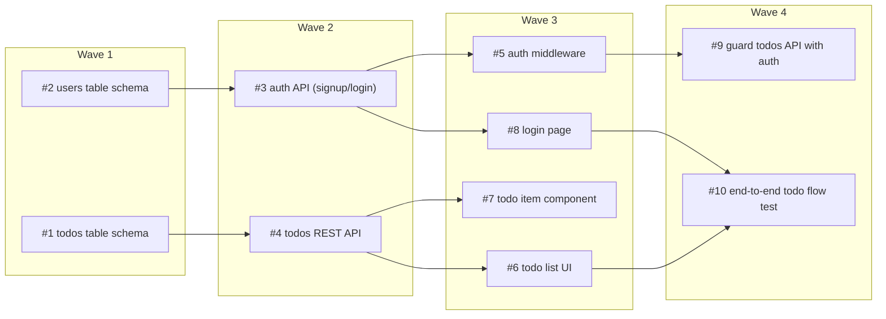

# Sprint 1 — a todo app with auth

Planned: 2026-06-14T18:30:00Z
Waves: 4   Issues: 10   Budget: $35

## Composition
| type | count |
|---|---|
| feature | 8 |
| improvement | 1 |
| qa | 1 |

## Issues
| # | type | title | files-owned | deps | wave |
|---|------|-------|-------------|------|------|
| 1  | feature     | todos table schema        | db/schema/todos.ts        | -     | 1 |
| 2  | feature     | users table schema        | db/schema/users.ts        | -     | 1 |
| 3  | feature     | auth API (signup/login)   | api/auth/routes.ts        | 2     | 2 |
| 4  | feature     | todos REST API            | api/todos/handlers.ts     | 1     | 2 |
| 5  | feature     | auth middleware           | api/middleware/auth.ts    | 3     | 3 |
| 6  | feature     | todo list UI              | ui/components/TodoList.tsx | 4    | 3 |
| 7  | feature     | todo item component       | ui/components/TodoItem.tsx | 4    | 3 |
| 8  | feature     | login page                | ui/pages/Login.tsx        | 3     | 3 |
| 9  | improvement | guard todos API with auth | api/todos/handlers.ts     | 5     | 4 |
| 10 | qa          | end-to-end todo flow test | tests/e2e/todo.spec.ts    | 6, 8  | 4 |

## Wave DAG

## Out of scope
- Password reset / email verification (next sprint)
- Real-time sync across tabs
- Mobile-responsive layout polish

## Definition of done (sprint)
- All sprint-1 issues merged
- `npm test` green, including the wave-4 end-to-end flow
- App runs locally: sign up, log in, create/complete/delete a todo
